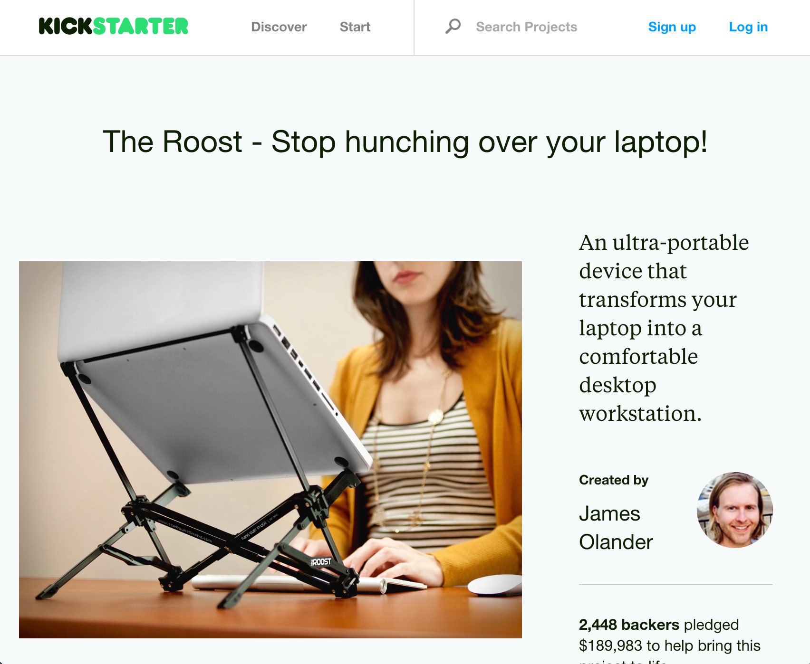

# Fundamentals of eCommerce

### Patrick Rauland
### @BFTrick

^ I should have just tweeted out the link to the presentation.

^ WAKE UP everyone.

---

# Concepts

^ I like to give people a guidemap to my presentations.

^ Something to follow along so we all know where we're going

---

# Concepts

1. **What** are you going to sell?

^ What you're going to sell is so important.

^ There's a lot to unpack here. What you're going to sell, who you're going to sell it to, how you're going to package and present that product, and so much more.

^ And it really is the first step in e-commerce. You can't decide on anything else until you've decided what you're going to sell.

---

# Concepts

1. What are you going to sell?
1. **Fundamentals**

^ There are two really big numbers when it comes to e-commerce. If you raise the first and lower the second you'l be in really good shape.

^ We'll get into exactly what each of those numbers are and why they're really important if you run e-commerce on your WordPress site or if you have a brick and mortar store.

---

# Concepts

1. What are you going to sell?
1. Fundamentals
1. How are you going to get **traction**?

^ One of the biggest misconceptions online is "if you build it they will come". The fact is that you *have* to find ways to get people to your site. This is a never ending process. No one in the history of the internet has said "I have too many users! OMG I wish people would stop buying from me!"

^ I have a book recommendation for you that will tell the benefits of each traction method and when to use it.

---

# Concepts

1. What are you going to sell?
1. Fundamentals
1. How are you going to get traction?
1. **Technicals**

^ Lastly, I do have to talk about technicals because people *always* like to know the nitty gritty details. We're going to be talking about some of the specific technical issues in e-commerce and how to approach them.

^ I am talking about a lot of stuff here. If we run out of time we'll cut out this part. If you have specific technical questions come up and ask me afterwards.

---

# What are you
# going to sell?

^ Probably the biggest question. Everything else comes after this question.

^ I always laugh when I see posts about which e-commerce platform is best. Anyone being honest will say "it depends... on what you're selling." Something that works great for selling an e-book on your blog might not be great for fulfilling 1,000 orders a day.

---

## *Who* are you going to sell to?

^ This is a really important question to ask. There's a big different if you're selling shampoo products whether you're going to market it towards individuals or towards salons. Individuals will want branding that makes them want that bottle and salons will want bulk discounts and maybe retailer pricing so they can sell it to their clients.

^ Salons might care if there's a reaction for 1% of the people while if you're selling to an individual might not like that you made their hair itchy and they won't buy it again.

---

## How you’re going to sell that product

^ There's a big difference between buying a razor on Amazon.com and buying a razor with DollarShaveClub.

^ On Amazon you look through thousands of models and you pick just the right one for you. On dollar shave club you look through a couple products and you pick one that's closest for you.

^ Amazon is selling you a razor. Do you know what Dollar Shave Club is selling you?

---

> Amazon sells you a razor. Dollar Shave Club sells you convenience.

^ This is true even if it's the exact same razor.

^ My point here is that the way you package and market your products will determine *why* people buy them.

---

## Validate Your Idea

^ this is something I harp on a little bit because some people are so convinced an idea will work and they'll invest hundreds of hours or thousands of dollars and then nothing happens. They just built a site that no one actually wants. I don't want a single person to experience that.

^ So there are a couple things you can do.

---

^ One of the ways that takes the most work is creating a Kickstarter Campaign.

^ he talked about the pros and cons of existing laptop stands and how his was better. He raised **$189,983** towards his goal. He made so much he could afford machine to automate part of the production process.

---

> Pre-paying is the *best* form of validation

---

^ this was a post I wrote on my blog. I was talking about WooCommerce and how this particular bit of user experience bugged me. I didn't think it should be the default setting but I thought some store may like this particular setting.

^ So I wrote about it and put a contact form on my blog and said "if you want this functionality email me". And after a dozen emails I wrote a bit of software and sold that extension.

^ The best part about this is that I KNEW I had at least a dozen people (probably more) that wanted that product before I even made it.

---

^ Now if you don't have platform where people are already browsing your site then you can use tools like Google Trends or Google Adwords and see how many times people are looking for certain words. There are entire guides dedicated to helping you see exactly how many people are looking for a particular term and how fierce the competition is

^ We've finally covered figuring out what product you want to sell. Now let's talk about some fundamentals.

---

# Fundamentals

^ There are two numbers that anyone selling anything should know. These numbers apply to freelancers just as much as they apply to e-commerce stores.

---

## Customer Lifetime Value (CLV)

^ this is the expected amount of money you'll make from each customer. There are a number of ways to calculate it. My recommendation is to look through your own data and see on average how much your customers spend.

^ The goal here is to raise it. Let me cover the other number and then I'll go into ways to raise that number.

---

## Cost of Acquisition (CoA)

^ The cost of acquisition or aquisition cost is the amount of time or money you spend to get someone to your site. This could be paying for an ad. Or it could be the amount of hours you spend writing a blog post to get someone to your site.

^ Either way this is the "work" and you want to minimize the work you to do to bring someone to your site to purchase.

^ Typically the CoA in e-commerce is *per customer* not *per visitor*.

^ Ex. selling a helicopter vs selling a slinky

---

## Raise CLV

^ Get repeat business. This could be getting people on a newsletter reminding them to come back. This could be posting on Facebook so they see your name and come back to see what's new. This could just be having a product that needs replacing every few years.

^ The CLV on an apple fan is HUGE. Every couple of years I buy a new laptop, then an iPhone, then an iPad. And that adds up.

^ That brings us to the next point - get higher order values. Give people a reason to buy more. That could be upselling them on a better product. Or it could be encouraging them to buy accessories with a main product.

---

## Lower CoA

^ Expensive CoA is advertising. If you have a budget it's a great way to rocket start your e-commerce business but as advertising channels become more and more saturated things get more expensive and they'll become cost prohibitive. That's when you want to have more passive sources of getting people to your site. Focus on SEO and content marketing to bring people to your site.

^ A good example is Pinterest ads. That ad platform just opened up to Beta and so far I've head people at getting 400% ROI which is insane. However - that's because it's new. Once people figure out that pinterest ads look like they'll stop clicking on them so much and there will be more adveritisers there to raise the prices. That's when you want more passive ways of getting people to your site.

^ Does anyone know the absolute cheapest form to acquire a new customer? Word of Mouth. It's brilliant. It costs you NOTHING.

---

# Traction

^ This is one of my favorite topics. Because people always underestimate how much work they have to do to get customers.

^ There's a fantastic book called Traction (look for the yellow cover because there are a few books called Traction) which goes over all of this in greater detail.

^ Let me start by saying I'm really frustrated at all of these online tutorials that tell you how to optimize your checkout or how to use intelligent recommendation algorithms to recommend better products for your customers. That's all cool but it's so dependent on where you are a business

---

> Traction channels
depend on the stage
of *your* business

---

## Search Engine Optimization (SEO)

^ SEO is all about getting ranked highly. A good example of a website with good SEO is wikipedia. They have good content and they have a ton of links pointing to them so they almost always rank first for a specific word.

^ SEO is a long term strategy. Really slow to get moving but "free" after you get to the top.

---

## Search Engine Marketing (SEM)

^ paid advertising on Google Adwords or Facebook or somewhere else.

^ A great traffic channel because it's instant and trackable (and some people love their data). And as long as your CoA is lower than your CLV keep pumping money into it.

---

## Presentations

^ Go to conventions or meetup groups and talk about the problems you can solve. This is a cheap and easy way to help people and spread your message. Not great later on as the impact becomes less and less.

---

## Affiliate Marketing

^ You pay people for a completed transaction. Keep your CoA lower than your CLV and it's totally worth it. If you have a virtual product you can usually work out a good deal for both of you. Good depending on the product.

---

## Newsletter Marketing

^ This is a way to keep people engaged and coming back. A really great strategy but you first need people coming to your site. You need to have at least one traction channel working for you before you implement this.

^ these are just a few few few traction methods. Read the book and see all of them.

---

# Technicals

---

## Payment

^ PCI Compliance

^ Country / currency limitations

^ Product restrictions

^ On site / Off site

---

## Shipping

^ Flat rate

^ Live shipping quotes

---

## Order fulfillment

^ Syncing orders between stores

^ Show petchup

---

# Patrick Rauland

## WooCommerce Product Manager
## at Automattic

## @BFTrick

^ Any Questions?
